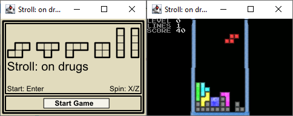

# (2007) Stroll: On Drugs - a Tetris game with a twist

This is a sample and behaviour accurate clone of the 1984 Gameboy version with a twist.

It simulates the disorientation of being intoxicated via an emulation of Mode 7 (from the SNES and GameBoy Advance).

Included in the codebase is a loose emulation of the GameBoy Advance GPU with tiled and bitmapped layers (but with RGB pixels instead of using a palette).

It replicates the following:
1. Levels and their timings (including the timing of wall clearing, block falling, accelerated block falling, and block-setting delay)
2. Wall kick behaviour
3. Rotation of blocks (including rules for rotations that can allow you to tight fittings)

Improvements and missing features:

:heavy_plus_sign: Piece generation is improved (allocation of pieces is well distributed so that you never have repeat tetrion, or long streams with any tetrion absent).

:heavy_minus_sign: Does not display next tetrion.

:heavy_minus_sign: You actually can't lose.